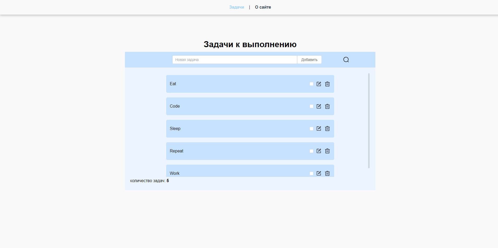

# TaskList

Первое приложение, написанное с использованием фреймворка Vue.

## Команды для запуска:

### `npm run serve`

Запускает приложение,
перейдите по [http://localhost:8080](http://localhost:8080) чтобы увидеть в браузере.

### `json-server --watch db.json`

Запускает сервер, который подключается к json-server и слушает порт 3000 (команду вводить в папке server)

### `npm run build`

Производит сборку проекта

## О проекте

TaskList - приложение-планер, в котором пользователи могут создавать задачи для выполнения.
Реализовано следующее: подгрузка задач(моковые данные), добавление задачи, поиск,
задачу можно изменить или удалить, а также отметить как выполненная

## Используемые технологии:
- Axios (интерфейс для HTTP-запросов)
- Vue (веб-фреймворк)

## Изображение сайта:
 
